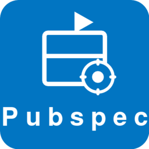

  

<h1 align="center">Pubspec Manager</h1>

  Visual GUI editor for <code>pubspec.yaml</code> — browse, search, update, and manage your Dart & Flutter dependencies with ease.

  
  
  

<b>If you find this extension useful, please star the repository to support the project!</b>

---

  

## Features

- **Visual Editor** — Full GUI for editing `pubspec.yaml` instead of raw YAML
- **Smart Dependency View** — All dependencies in one unified list with tag-style filters: *All*, *Dependencies*, *Dev*, *Update Available*
- **Text Filter** — Instantly search and filter packages by name
- **Outdated Detection** — Automatically checks pub.dev for newer versions with color-coded badges (green / yellow / red)
- **One-Click Updates** — Update individual packages or all outdated packages at once
- **Search & Add** — Search pub.dev directly, see likes and points, and add packages without leaving VS Code
- **Package Info** — Hover the info icon on any package to see its description
- **Remove Packages** — Remove dependencies with one click
- **Metadata Editing** — Edit name, description, version, homepage, repository, and SDK constraints
- **Pub Get** — Run `dart pub get` / `flutter pub get` from the toolbar
- **Round-Trip Safe** — Edits preserve your YAML comments and formatting
- **Dart & Flutter** — Auto-detects project type and uses the correct commands

## Getting Started

1. Install the extension from the [VS Code Marketplace](https://marketplace.visualstudio.com/items?itemName=doonfrs.pubspec-manager-gui)
2. Open any `pubspec.yaml` file in VS Code
3. Click the **package icon** in the editor title bar (top-right)

That's it! You can also access it via:
- Right-click `pubspec.yaml` in Explorer → **Open Pubspec Manager**
- Right-click in the editor → **Open With...** → **Pubspec Manager**
- Command Palette → **Pubspec Manager: Open Pubspec Manager**

## Requirements

- VS Code 1.85.0 or later
- Dart SDK or Flutter SDK installed and available in PATH

## 🤝 Contributing

Contributions are welcome! If you'd like to help improve Pubspec Manager, here's how you can contribute:

- **Star the repository** to show your support
- **Report bugs** by opening issues
- **Suggest new features** or improvements
- **Submit pull requests** to fix issues or add functionality
- **Improve documentation** to help other users
- **Share the extension** with others who might find it useful
- **Sponsor the project** to support its development — [Buy Me A Coffee](https://buymeacoffee.com/doonfrs)

## License

MIT
